# keymap

## Layers    
There are 3 layers: Alpha Layer, Mouse Layer, and Number Layer. From any of those three layers, the other two layers can be momentarily accessed by pressing and holding either of the space buttons.

### Alpha Layer
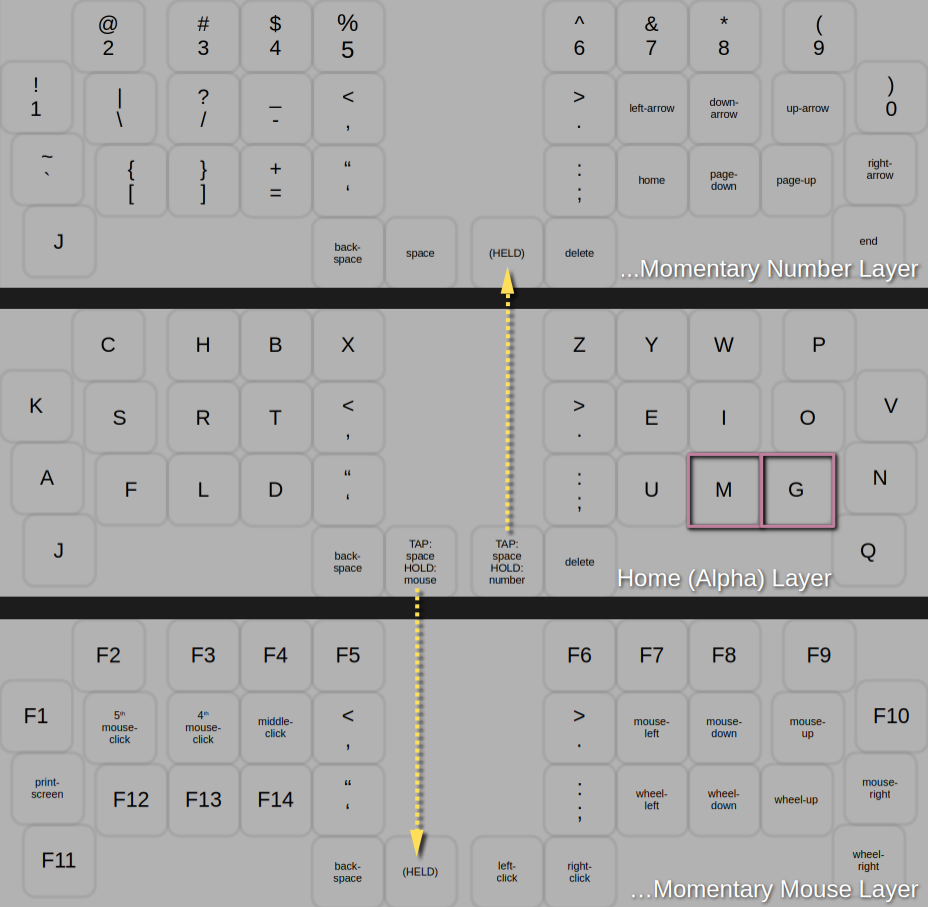  

### Mouse Layer
Note: Since holding down the left-click button is a common use case, you must first access the Alpha Layer with the left thumb before accessing the Number Layer with the right thumb.  
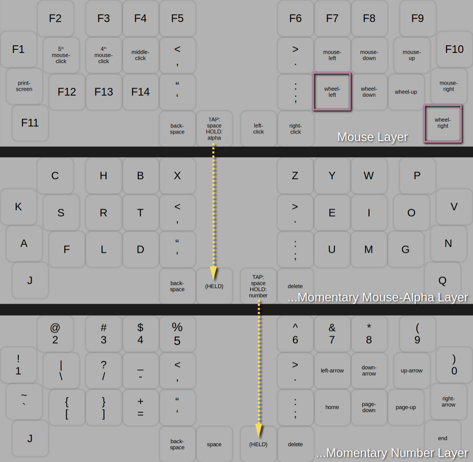  

### Number Layer
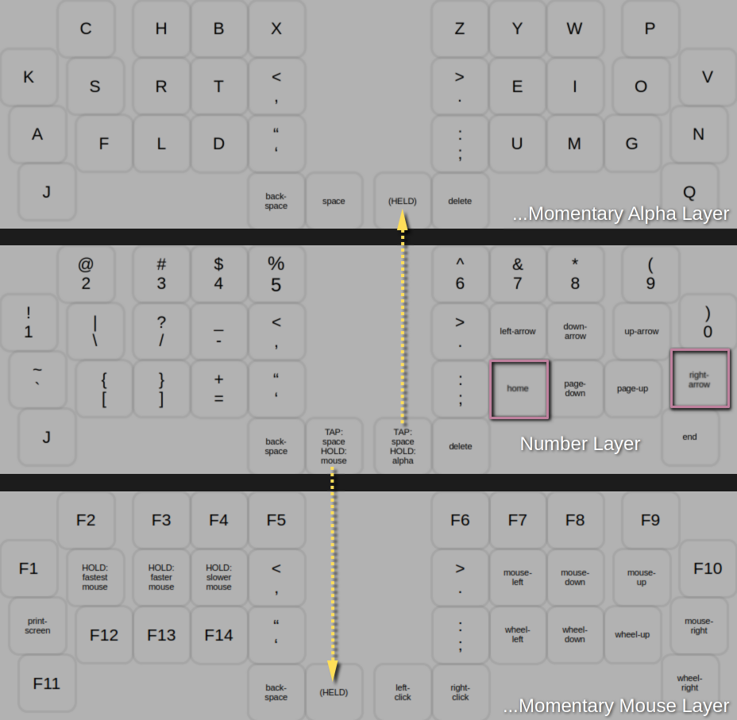  

## Combos    
### Tab, Shift, Caps-Lock, Alpha-Layer...
Note the Caps-Lock combo only turns Caps-Lock on. Caps-Lock is turned off when a modifier or layer-switching combo is pressed.   
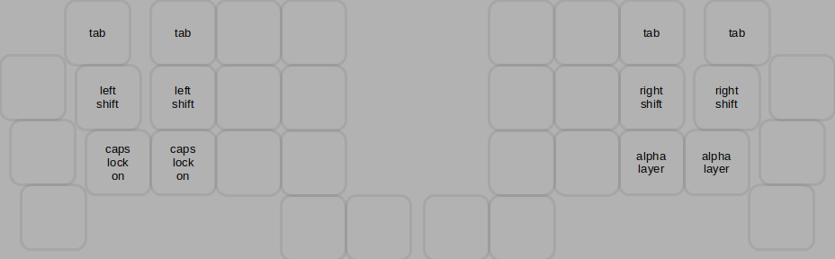  
### Enter, Escape...   
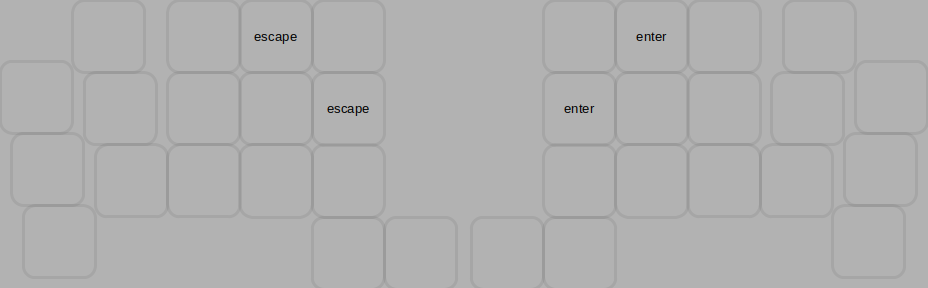  
### Control, Alt, Left-Hand-Mouse-Layer, Mouse-Layer...  
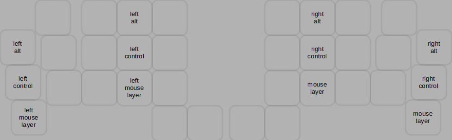  
### OS, Left-Hand-Arrow-Layer, Number-Layer
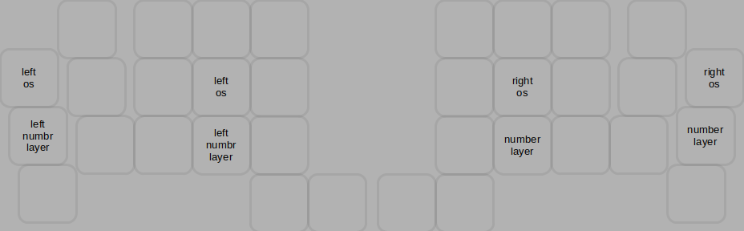  
### 2D-Game-Layer, 3D-Game-Layer...   
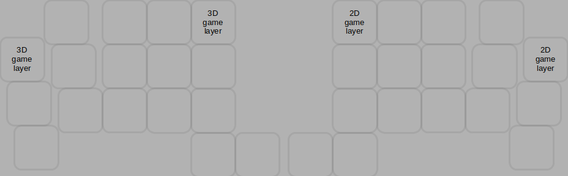  

## Reset Buttons    
The small buttons on the top-left-corner and top-right-corner of the keyboard are the Reset Buttons. Press the button on the plugged-in half of the keyboard to Reset the keyboard's state. Note that this is the only way to exit the 2D-Game-Layer and 3D-Game-Layer. You will also use these buttons if and when you flash the CPU with firmware modifications/updates.   

## Bonus: Left Hand Layers   
### Left-Hand-Mouse-Layer
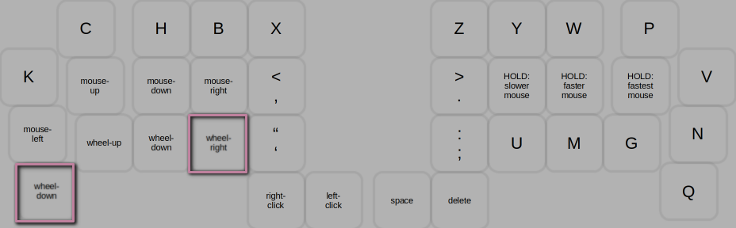   
### Left-Hand-Arrow-Layer
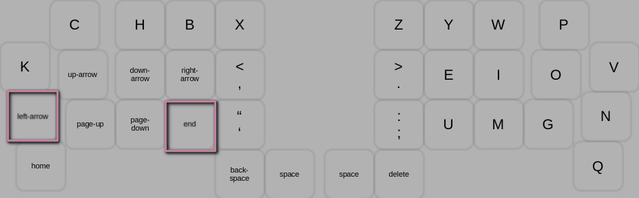   

## Bonus: Game Layers   
### 2D-Game-Layer
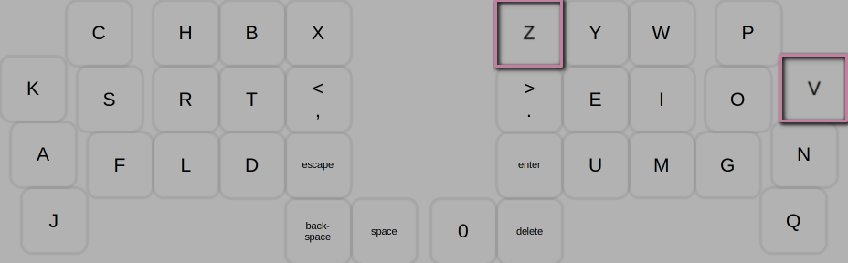  
### 3D-Game-Layer
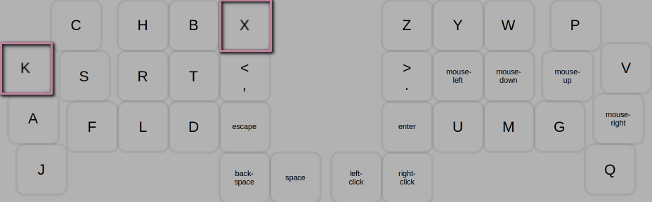  

