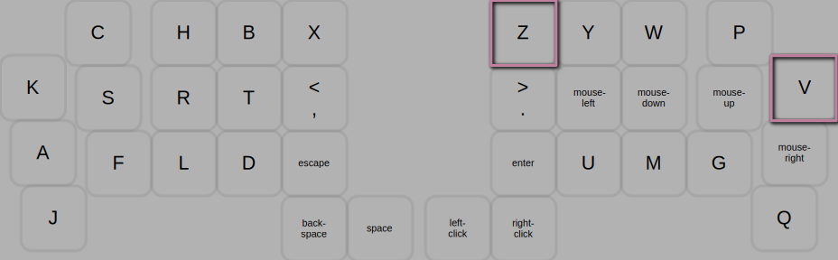

# tomsadowski keymap
There are 3 layers: Alpha Layer, Mouse Layer, and Number Layer. From any of those layers, the other two layers can be momentarily accessed by holding either of the space buttons.

---
## Alpha Layer
  

---  
## Mouse Layer
  
Note: Since holding down the left-click button is a common use case, you must first access the Alpha Layer with the left thumb before accessing the Number Layer with the right thumb.  

---  
## Number Layer
  

---  
## Combos  
The caps-lock combo only turns caps-lock on. Caps-lock is turned off when a modifier or layer-switching combo is pressed.   
  
  
  
  

---
## Lefty Layers   
### Left Hand Mouse   
   
### Left Hand Arrows   
   

---
## Game Layers   
### 2D Game Layer
  
### 3D Game Layer
  

