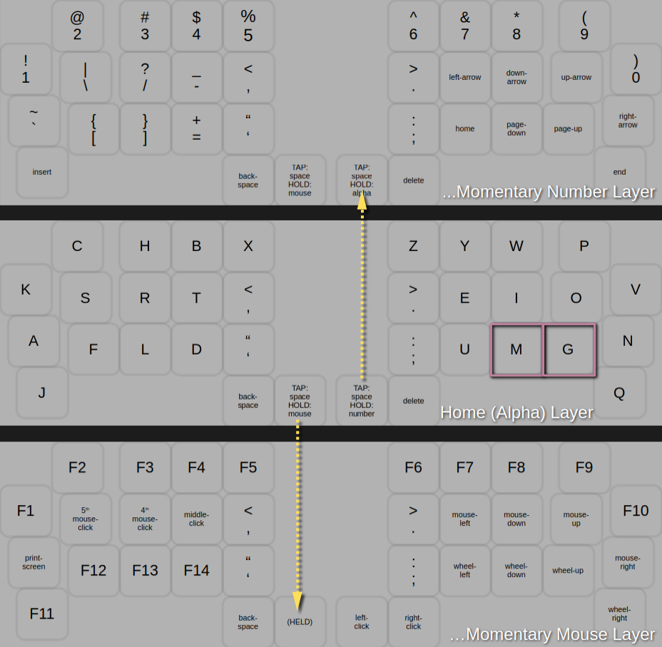
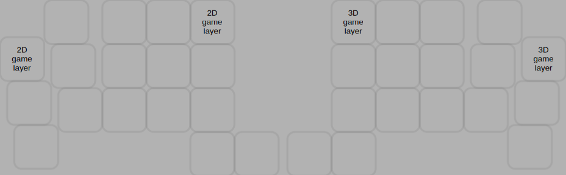
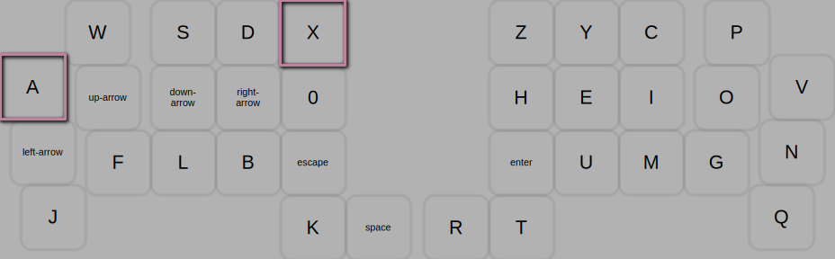

# pearbear keymap

There are 3 layers: Alpha Layer, Mouse Layer, and Number Layer. From any of those layers, the functionality of the other two layers can be momentarily accessed by holding either of the space buttons. The visuals below should clarify this.   

## Alpha Layer
  

## Mouse Layer
  
Remarks: Since holding down the left-click button is a common use-case, you must first access the Alpha Layer with the left thumb before accessing the Number Layer with the right thumb.  

## Number Layer
  

---  

## Combos  

### middle-ring combos
  
Remarks: The caps-lock combo only turns caps-lock on. Caps-lock is turned off when a modifier or layer-switching combo is pressed.   

### pointer-pinky combos
  
  
  

### pointer-middle combos
  

---  

## Lefty Layers   
Use these layers when you are eating food and need to control youtube.

### left-arrow

### left-mouse
   

---  

## Game Layers   
Combos disabled, hold-tap disabled. Must press the board's reset button to leave these layers. Use these layers when you want to play a video game.

### 2d-game-layer
  

### 3d-game-layer
  
