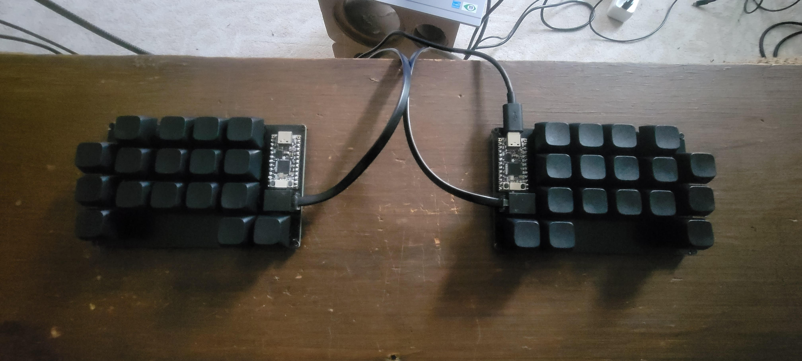

# Pearbear

2) Order the PCB
  * 1) Download the [specification file](mx/production/pearbear_mx.zip)
  * 2) Upload the file to a PCB [fabrication service](https://jlcpcb.com/)
3) Bill of Materials
  * a) 2x [Adafruit KB2040](https://www.adafruit.com/product/5302#tutorials)
    * product id: 5302
    * [datasheet](datasheets/Adafruit_KB2040_Pinout.pdf)
  * b) 2x [6P6C RJ11 socket](https://www.digikey.com/en/products/detail/w%C3%BCrth-elektronik/615006138421/2060609) 
    * manufacturer product number: 615006138421
    * digikey part number: 732-2113-ND
    * [datasheet](datasheets/WR-MJ.pdf)
  * c) 2x [6mm B3F-10xx tactile switches](https://www.digikey.com/en/products/detail/adafruit-industries-llc/367/10669771)
    * manufacturer product number: 367
    * digikey part number: 1528-367-ND
    * [datasheet](datasheets/B3F-1000-Omron.pdf)
  * d) 34x [Cherry MX switches](https://mechanicalkeyboards.com/products/cherry-mx2a-silent-red-45g-linear)
    * [datasheet](datasheets/Cherry_MX.pdf)
  * e) 34x [XDA Keycaps](https://ymdkey.com/products/xda-1u-new-keycapsblank-pbt-1-55mm)
  * f) Substrate
    * 1x Mousepad
    * 12x M2 screws
    * 12x M2 hex nuts
    * Needle and thread  
4) Assembly
  * 1) Solder 3.a - 3.d to PCB (beginners guide pending)
  * 2) Stitch mousepad to PCB using 3.e
5) Flash microcontrollers with [QMK firmware](pbqmk)
