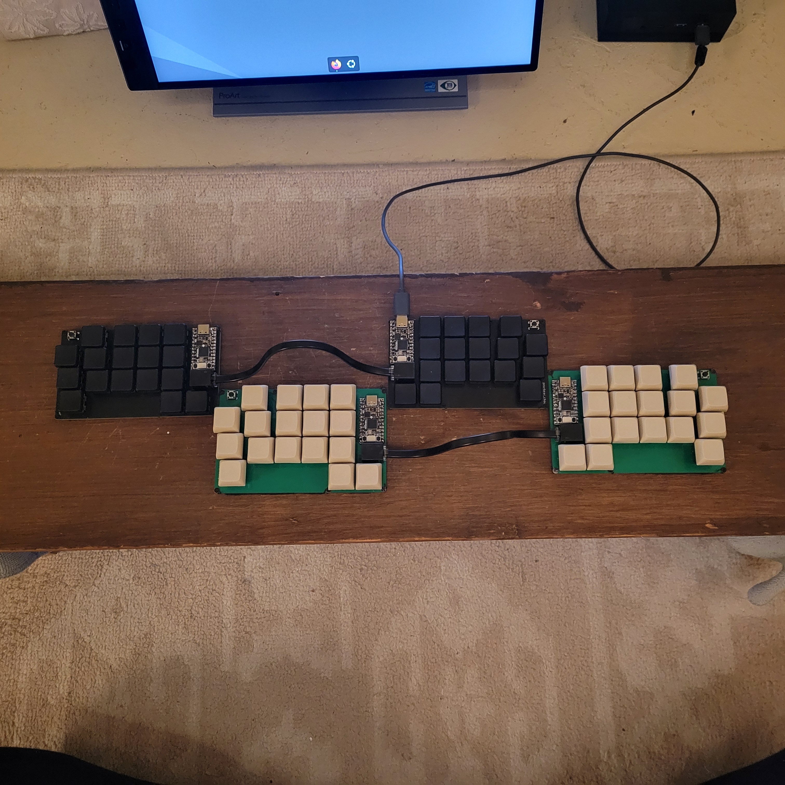

# Pearbear

1) Choose a variant
  * [Cherry MX](/mx) for traditional key size and spacing
  * [Kailh Choc V1](/choc_v1) for small key size and spacing
2) Order the PCB
  * 1) Download the specification file (VARIANT/production/pearbear_VARIANT.zip)
  * 2) Upload the file to a PCB fabrication service (I've used Osh Park and JLCPCB)
3) Buy all the bits
  * a) 2x Promicro-compatible microcontroller boards (I use Adafruit KB2040)
  * b) 2x TS6 RJ11 sockets
  * c) 34x mechanical switches (Cherry MX or Kailh Choc V1)
  * d) 2x 6mm B3F-10xx tactile switches (optional)
  * e) Substrate (optional)
    * 1x Mousepad
    * 12x M2 screws
    * 12x M2 hex nuts
    * Needle and thread  
4) Assembly
  * 1) Solder 3.a - 3.d to PCB (beginners guide pending)
  * 2) Stitch mousepad to PCB using 3.e
5) Flash the promicros with the [QMK firmware](https://github.com/tomsadowski/qmk_userspace/tree/main/keyboards/pearbear)
